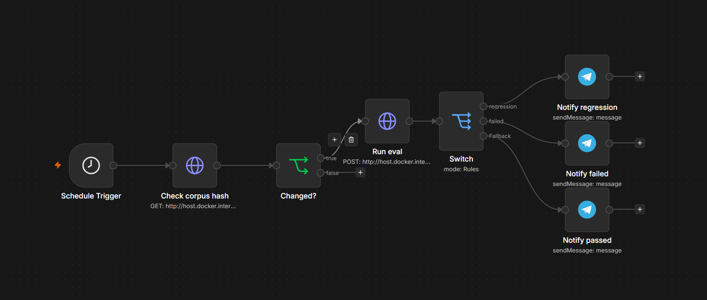

# Golf Agent

[](https://github.com/Sneakus/Golf-Agent/actions/workflows/eval.yml)

A golf fault-diagnosis system. You describe a bad shot in plain language and it retrieves the relevant entry from a hand-written corpus, then produces practical setup advice and one swing thought.

Built as a retrieval and evaluation exercise. The golf is the domain; the interesting part is that every design decision is measured rather than assumed.

## Results

The live retrieval pass is seven entries, with no top-1 guarantee and reciprocal rank fusion at k 60. Retrieval is scored on 59 answerable queries and 8 that should be declined. When every query passes, the interval is a Wilson 95% interval, because a bootstrap interval collapses to a single point. Otherwise the interval is a 95% bootstrap over 10,000 resamples.

| Metric | Result | 95% interval | What it means |
|---|---|---|---|
| hit@1 | 0.746 | 0.627 to 0.847 | Correct entry ranked first |
| hit@5 | 0.966 | 0.915 to 1.000 | Correct entry somewhere in the top five |
| hit@7 | 59 of 59 | 0.939 to 1.000 | Correct entry in the seven entries passed to the model |
| recall@7 | 0.959 | 0.919 to 0.992 | Share of relevant entries found in those seven |
| MRR | 0.839 | 0.761 to 0.906 | How high the first correct hit lands |
| NDCG@7 | 0.858 | 0.794 to 0.915 | Rank-weighted quality of the top seven |
| Abstention | 8 of 8 | | Out-of-scope and no-fault queries declined, with no false declines |
| Answer accuracy, shown | 58 of 58 | 0.938 to 1.000 | Diagnosed entry matches the label, among answers actually shown |
| Answer accuracy, overall | 58 of 59 | 0.910 to 0.997 | Same score over every answerable query. A clarifying question counts as not correct |
| First-pass repairs | 7 | | Answers rewritten once before they were shown |
| Failures shown | 0 | | No failed answer is shown to the golfer |
| Clarified | 1 | | Query 13 asks where the ball started and which way it curved |
| Cost per full batch | about $0.47 | | Half-price batch. A cached rerun spends $0 |

hit@5 means the correct entry appeared somewhere in the top five. It does not mean the tool gave the right answer. Ranking it first is hit@1, 0.746.

An AI-assisted review read every answer from the last full batch: 46 fully correct, 11 flawed, and 2 wrong. Real-world testing on the course is still going.

## Known limits

Query 38 regressed. The golfer said the break never took, and the answer says the putt was too slow.

Query 13 never said where the ball started. The answer failed validation, so the golfer now gets a clarifying question instead of that advice.

The eval set is saturated on diagnosis: the last batch matched the labelled entry on all 59 answerable queries. Further improvement needs new queries that were not used to tune the system.

The seven-entry pass was chosen by sweeping this same eval set. The gain is measured on the queries used to choose it. Passing more candidates is a structural change rather than a tuned knob, which limits the overfitting risk, but it does not remove it.

**On significance.** 59 answerable queries means one query is worth 1.7 points. The information retrieval literature treats 50 queries as a working minimum and suggests roughly 150 to reliably distinguish systems, so differences smaller than the confidence interval width are not meaningful. The improvements below are directional.

## How it works

**Corpus.** 54 entries: 45 fault entries, 8 out-of-scope entries, 1 no-fault entry. Each fault entry carries a plain-English alias line of how a golfer would actually describe the miss, the mechanical definition, several possible causes each with a distinguishing signal, fixes written as external-focus cues, an evidence tier, and a note on what the fix might break.

Causes are always plural. A slice can come from path, from face angle, or from a heel strike, and a system that picks one will be confidently wrong.

**Retrieval.** Hybrid. BM25 keyword search and dense embeddings run in parallel and the two rankings are fused with reciprocal rank fusion. Semantic search handles paraphrase; keyword search catches rare distinctive terms that embeddings average away.

**Abstention.** Out-of-scope questions are handled by giving retrieval something correct to return rather than by a confidence threshold. Equipment, rules, handicap, mental game, injury, etiquette each have an entry. If one ranks first, the tool declines and redirects.

**Generation.** The model fills a strict tool schema: what happened, up to three setup steps, one headline thought, and why. Each setup step names the entry and the exact Fixes or Adjustments line it comes from, and must share meaningful words with that line. Code writes "If it keeps happening" from the differential table, in either direction, using the table's own words, and builds the sources list from every entry the answer used. On a tee shot the follow-up skips rows that involve a lie. Compensation notes and evidence tiers are removed from the text the model sees. They stay in the corpus and in the retrieval index. Strategy and conditions headlines are labelled Key thought. The one-thought limit still applies only to that headline. If an answer still fails validation after one repair, it is not shown. The golfer is asked where the ball started and which way it curved.

Live Anthropic calls require `GOLF_LIVE=1`. A batch submits only requests that are not already cached, so a fully cached run makes no API call and does not need `GOLF_LIVE`. Responses are cached by a hash of the request. A live eval prints the cost from the last full saved run and stops above $0.50 unless `--confirm-cost` is set. The summary then separates money spent on this run from the original cost of producing those answers. `--max-calls` defaults to 25. Generation reads `retrieval_snapshot.json` unless `--fresh-retrieval` is given, and refuses a snapshot whose configuration hash does not match. The model's self-reported fit field was removed: it never fired in testing, including on the two known retrieval misses.

Refusal is decided in code before the model is called. A model handed a question and loosely related documents will usually find something to say, so removing the opportunity is more reliable than instructing against it.

## What the evaluation found

**A chunking bug, found by reading failures.** One corpus entry was absorbing the trailing sections of the file, making it roughly eight times the mean entry length. Its own content was drowned and it never retrieved. Fixing it moved hit@1 from 0.61 to 0.66.

**Alias weighting beat three alternatives.** Four embedding strategies compared on the same queries. Repeating the alias line before the full entry text won at 0.73 hit@1. Alias-only matched it on the own-voice subset but dropped the misdiagnosis subset from 1.00 to 0.88, because those queries need the situational detail in the body text.

**BM25 alone beat dense embeddings**, 0.93 against 0.90 at k=5, winning on every subset. Expected for a small corpus of terminology-dense documents, where rare terms carry most of the signal and there are few enough documents for IDF statistics to be meaningful. Two queries failed dense retrieval in every run despite containing the target entry's own distinctive vocabulary.

**Hybrid fusion fixed four queries and broke none**, reaching 0.95 at k=5. A subsequent corpus fix, adding missing plain-language phrasings to one entry, took it to 0.966.

**The confidence threshold was doing pure harm.** Swept every value from 0.20 to 0.60. Missed refusals were zero at every threshold, because the out-of-scope entries catch everything on their own. At 0.40 the threshold's only measured effect was refusing three legitimate questions. Set to 0.35, below the lowest genuine query at 0.388.

**Plain-language substitutions beat outright bans.** Twelve generation validation failures, six jargon and six over-length. Giving the model a plain phrasing for each banned term, rather than only forbidding the term, cleared all twelve without the repair loop firing.

**Reading generated answers found two L001 corpus problems that validation did not.** Ambiguous posture wording produced "stay tall", the opposite of the correct cue, while an overstated loft explanation led to a claim that a 3-wood has extra loft. Both were fixed in the entry. Retrieval remained unchanged at 0.966 hit@5. The posture fix was checked on both L001 queries and the loft fix on the 3-wood query; this was not a full generation rerun.

## Running it

```bash
pip install openai anthropic numpy
export OPENAI_API_KEY=...     # embeddings
export ANTHROPIC_API_KEY=...  # generation

# retrieval eval with full metrics
python evaluate.py --corpus golf-fault-corpus-v3.md golf-out-of-scope-entries.md \
                   --evals golf-eval-sets-v2.md

# ask it something
python generate.py --corpus golf-fault-corpus-v3.md golf-out-of-scope-entries.md \
                   --query "chunked my wedge, took a divot before the ball"

# print only the finished answer, suitable for direct display
python generate.py --corpus golf-fault-corpus-v3.md golf-out-of-scope-entries.md \
                   --plain --query "chunked my wedge, took a divot before the ball"

# generation eval across the full query set
python generate.py --corpus golf-fault-corpus-v3.md golf-out-of-scope-entries.md \
                   --evals golf-eval-sets-v2.md --eval-mode

# compare embedding strategies
python compare_strategies.py --corpus golf-fault-corpus-v3.md golf-out-of-scope-entries.md \
                             --evals golf-eval-sets-v2.md

# compare dense, BM25 and hybrid
python hybrid_eval.py --corpus golf-fault-corpus-v3.md golf-out-of-scope-entries.md \
                      --evals golf-eval-sets-v2.md

# derive the refusal threshold from the data
python tune_threshold.py --corpus golf-fault-corpus-v3.md golf-out-of-scope-entries.md \
                         --evals golf-eval-sets-v2.md
```

The eval runs in CI on every push touching the corpus, the eval set or the retrieval code, and fails the build if recall@5 drops below 0.90.

## Automation

The eval runs in two places, which gives a direct comparison between the two tools.

**GitHub Actions.** Runs on every push touching the corpus, the eval set or the retrieval code. Fails the build if recall@5 drops below 0.90.

**n8n, self-hosted.** Polls for corpus changes, triggers a re-evaluation, compares against the previous run, and routes to one of three notifications depending on whether it passed, failed the gate, or regressed.



Workflow export: [`n8n-workflow.json`](n8n-workflow.json). Full specification: [`n8n-pipelines.md`](n8n-pipelines.md).

**One architecture note.** The n8n Docker image has no Python, so running the eval through the Execute Command node was not possible. Rather than building a custom image, the Python is exposed as a local FastAPI service (`eval_service.py`) that n8n calls over HTTP. That keeps n8n orchestrating rather than shelling out, and keeps the retrieval work in Python.

## Files

| File | What it is |
|---|---|
| `golf-fault-corpus-v3.md` | 45 fault entries across swing, putting, distance, lie, strategy, conditions, recovery |
| `golf-out-of-scope-entries.md` | 8 out-of-scope entries and 1 no-fault entry |
| `golf-eval-sets-v2.md` | Eval sets, dated results log, and the reasoning behind each change |
| `evaluate.py` | Canonical eval. Full metric set, bootstrap CIs, latency, cost, CI gate |
| `generate.py` | Generation layer with schema-constrained output and enforced refusal |
| `eval_harness.py` | Corpus and eval parsing, embedding |
| `hybrid_eval.py` | BM25 implementation and fusion, dense vs sparse vs hybrid comparison |
| `compare_strategies.py` | Embedding strategy comparison |
| `tune_threshold.py` | Threshold sweep |
| `golf-shot-log-schema-v2.md` | Data model for the logging layer |
| `golf-club-table-and-picker.md` | Club baselines and the outcome picker UI contract |
| `n8n-pipelines.md` | Ingestion and quality-gate pipeline specification |
| `n8n-workflow.json` | The n8n workflow, importable |
| `eval_service.py` | FastAPI service n8n calls to run the eval |

## Scope

**Built:** corpus, hybrid retrieval, abstention, generation with enforced constraints, four eval sets, CI gating.

**Designed, not built:** the shot logging application, the feedback loop where a suggested fix is reported as worked or not, pattern detection across logged rounds, and the accumulating profile that would make advice personal rather than general.

**Deliberately out of scope:** equipment and fitting advice, rules procedure, anything medical. Each has an entry explaining why and pointing elsewhere.

**Not claimed:** this is not production RAG infrastructure. There is no separate vector store, because 54 documents in numpy is faster than a network call. No re-indexing at scale and no multi-tenancy. Those are problems this corpus does not have. Generation responses are cached locally so a repeated eval does not pay for the same request twice.

## Notes on the corpus

Entries are written from settled ball-flight physics: the clubface controls roughly 85% of start direction with a driver and 75% with a mid-iron, and the face angle relative to club path controls curvature. Fixes are phrased as external-focus cues, describing the intended effect rather than a body part to move, which the motor learning literature supports over internal cues.

Every entry carries an evidence tier: settled, consensus, contested, or contradicted. Some widely-taught fixes sit in the last category. "Aim left to cure a slice" makes the slice worse, because aiming left steepens the out-to-in path and widens the face-to-path gap.

One claim was deliberately excluded. The commonly repeated idea that golfers follow a developmental path from slicer to hooker is not supported by any longitudinal data. It is a cross-sectional correlation between different players at one moment, and independent on-course data shows the left-right miss split is close to even at most handicap levels.
